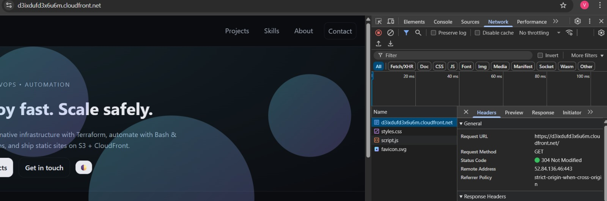

# Proof Pack: S3 + CloudFront (OAC) Static Website

Evidence that the site was deployed through Terraform + CI/CD and served over CloudFront. Use this if the stack is torn down.

## 1) Live site (CloudFront domain)

## 2) View Source (HTML)

## 3) Network headers (DevTools)

## 4) GitHub Actions — All runs

## 5) GitHub Actions — Apply (main)

## 6) Terraform Cloud — Runs

---

### Notes
- **Architecture**: CloudFront (HTTPS) → S3 private bucket via **OAC**. Bucket blocks public access; policy allows reads only from the CF distribution ARN.
- **CI/CD**: PRs run plan; `main` runs apply; automatic CloudFront **invalidation** after deploy.
- **State**: stored in Terraform Cloud (remote backend).

Generated: 2025-08-15 04:06:51Z UTC
